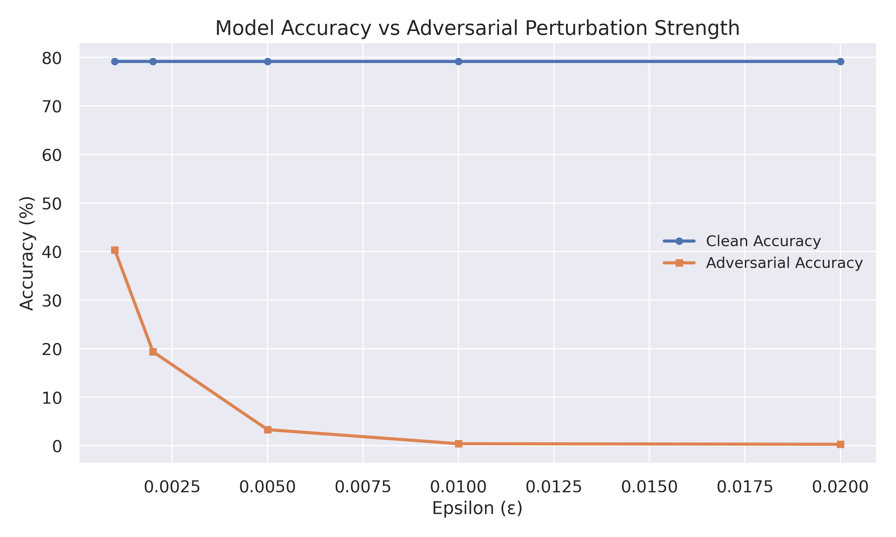
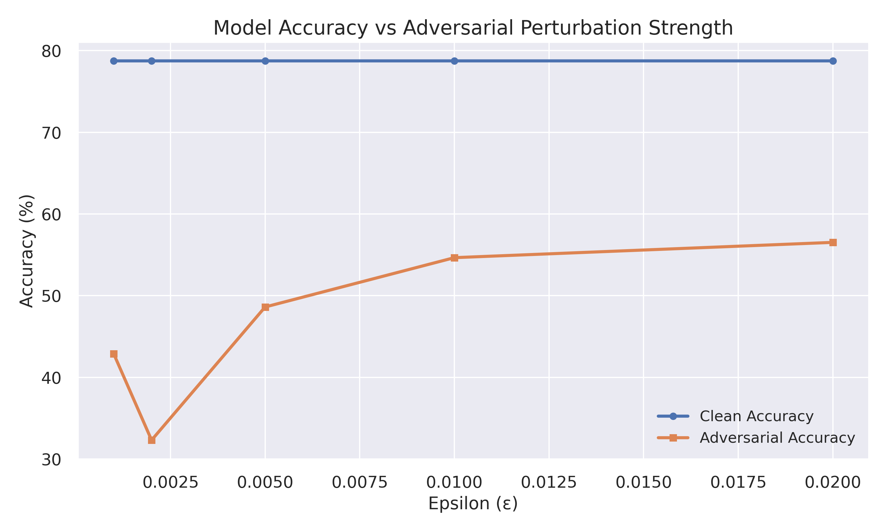
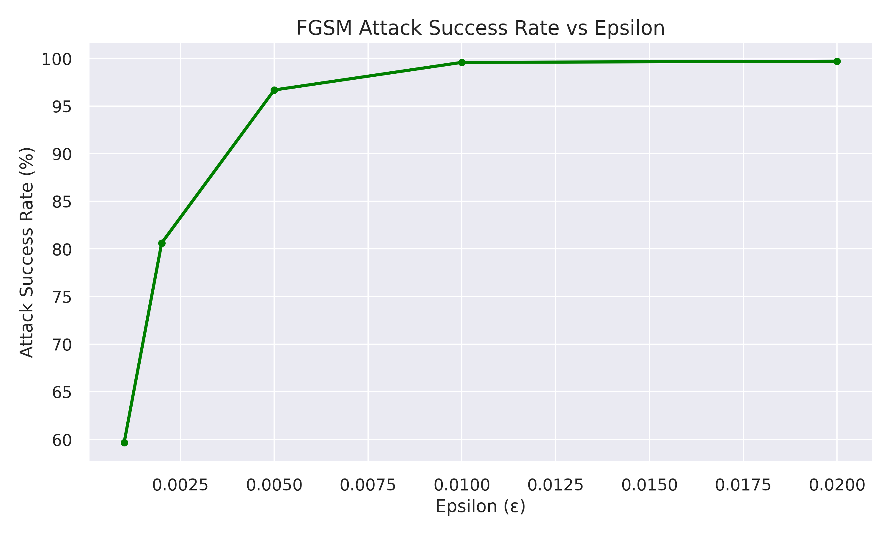
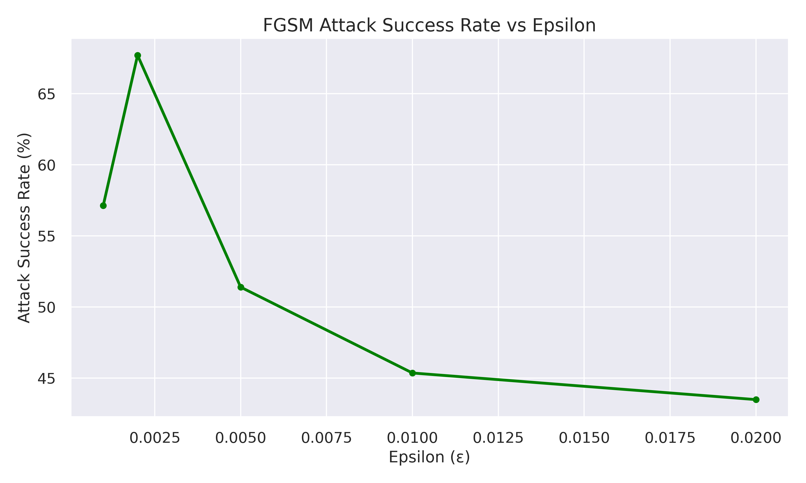
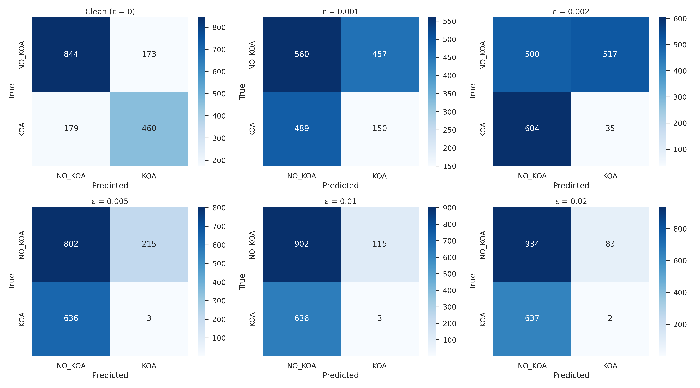
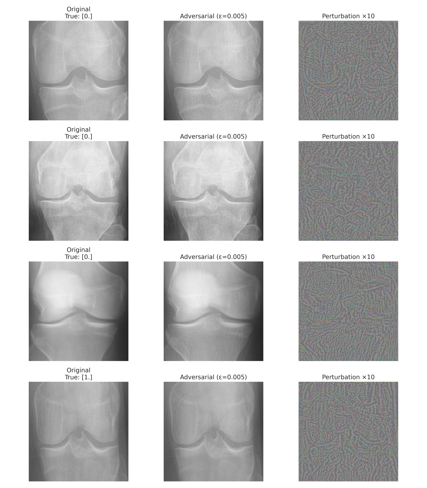

# Robust KOA Classification with VGG16 and FGSM Adversarial Training

This project implements a robust deep learning model for Knee Osteoarthritis (KOA) classification using VGG16 architecture with Fast Gradient Sign Method (FGSM) adversarial training. The model is designed to classify knee X-ray images into two categories: KOA (Knee Osteoarthritis) and NO_KOA (No Knee Osteoarthritis).

## Dataset

The model is trained on the [Knee Osteoarthritis Dataset with Severity](https://www.kaggle.com/datasets/shashwatwork/knee-osteoarthritis-dataset-with-severity) from Kaggle. The original dataset contains knee X-ray images categorized into five classes (0-4) based on the severity of osteoarthritis. For this project, we've converted these into a binary classification task:

- **NO_KOA (No Knee Osteoarthritis)**: Original class 0
- **KOA (Knee Osteoarthritis)**: Combines original classes 1, 2, 3, and 4

The dataset is split into three directories:
- `train/`: Training images
- `val/`: Validation images
- `test/`: Test images

Each directory contains two subdirectories:
- `KOA/`: Images with knee osteoarthritis
- `NO_KOA/`: Images without knee osteoarthritis

## Project Structure

```
.
├── Dataset/                    # Directory for dataset (not included in repo)
├── Results/                    # Directory to save model outputs and results
├── adv_test_epsilon_0005/      # Directory for adversarial test results with epsilon=0.005
├── fgsm_orig.ipynb             # Notebook for FGSM attack on original model
├── fgsm_robust.ipynb           # Notebook for FGSM attack on robust model
├── requirements.txt            # Python dependencies
├── test.ipynb                  # Testing script for model evaluation
├── vgg16_adv_training.ipynb    # VGG16 model with adversarial training
└── vgg_orig.ipynb              # Original VGG16 model training
```

## Requirements

To set up the environment, install the required packages:

```bash
pip install -r requirements.txt
```

## Usage

1. **Data Preparation**:
   - Download the dataset from [Kaggle](https://www.kaggle.com/datasets/shashwatwork/knee-osteoarthritis-dataset-with-severity)
   - The original dataset contains 5 classes (0-4) based on KL grading system
   - Convert the dataset into binary classification:
     - Class 0 → NO_KOA (No Knee Osteoarthritis)
     - Classes 1, 2, 3, 4 → KOA (Knee Osteoarthritis)
   - Organize the dataset into train/val/test directories with KOA and NO_KOA subdirectories

2. **Training the Original Model**:
   - Run `vgg_orig.ipynb` to train the baseline VGG16 model

3. **Adversarial Training**:
   - Run `vgg16_adv_training.ipynb` to train the model with FGSM adversarial training

4. **Testing and Evaluation**:
   - Use `test.ipynb` to evaluate model performance
   - Run `fgsm_orig.ipynb` and `fgsm_robust.ipynb` to test model robustness against adversarial attacks

## Results

The project compares the performance of the original VGG16 model with the adversarially trained model. The evaluation includes:

### Model Performance Metrics
- **Classification Accuracy**: Comparison between original and robust models
- **Robustness**: Evaluation against FGSM adversarial attacks with varying epsilon values
- **Attack Success Rate (ASR)**: Measurement of model vulnerability to adversarial examples

### Key Findings

#### Original VGG16 Model
- **Clean Accuracy**: 79.17%
- **Adversarial Accuracy (ε=0.001)**: 40.34% (38.83% drop)
- **Adversarial Accuracy (ε=0.005)**: 3.32% (75.85% drop)
- **Adversarial Accuracy (ε=0.01)**: 0.42% (78.74% drop)
- **Attack Success Rate (ε=0.005)**: 96.68%

#### Robust VGG16 Model (with FGSM Adversarial Training)
- **Clean Accuracy**: 78.74%
- **Adversarial Accuracy (ε=0.001)**: 42.87% (35.87% drop)
- **Adversarial Accuracy (ε=0.005)**: 48.61% (30.13% drop)
- **Adversarial Accuracy (ε=0.01)**: 54.65% (24.09% drop)
- **Adversarial Accuracy (ε=0.02)**: 56.52% (22.22% drop)
- **Attack Success Rate (ε=0.005)**: 51.39%
- **Robustness Improvement**: 45.29% increase in adversarial accuracy at ε=0.005

### Model Comparison

| Metric | Original Model | Robust Model | Improvement |
|--------|----------------|--------------|-------------|
| Clean Accuracy | 79.17% | 78.74% | -0.43% |
| Adversarial Accuracy (ε=0.005) | 2.23% | 49.03% | +46.80% |
| Attack Success Rate (ε=0.005) | 97.77% | 50.97% | -46.80% reduced |
| Accuracy Drop (ε=0.005) | 76.94% | 29.71% | -47.23% improvement |

### Visualizations

#### Accuracy vs Epsilon (Original vs Robust)
<div style="display: flex; justify-content: space-between;">
  <div style="width: 48%;">
    
    <p style="text-align: center;">Figure 1a: Original Model</p>
  </div>
  <div style="width: 48%;">
    
    <p style="text-align: center;">Figure 1b: Robust Model</p>
  </div>
</div>

#### Attack Success Rate vs Epsilon
<div style="display: flex; justify-content: space-between;">
  <div style="width: 48%;">
    
    <p style="text-align: center;">Figure 2a: Original Model</p>
  </div>
  <div style="width: 48%;">
    
    <p style="text-align: center;">Figure 2b: Robust Model</p>
  </div>
</div>

#### Confusion Matrices
<div style="display: flex; justify-content: space-between;">
  <div style="width: 48%;">
    
    <p style="text-align: center;">Figure 3a: Original Model</p>
  </div>
  <div style="width: 48%;">
    
    <p style="text-align: center;">Figure 3b: Robust Model</p>
  </div>
</div>

#### Adversarial Examples
<div style="display: flex; justify-content: space-between;">
  <div style="width: 48%;">
    
    <p style="text-align: center;">Figure 4a: Original Model</p>
  </div>
  <div style="width: 48%;">
    
    <p style="text-align: center;">Figure 4b: Robust Model</p>
  </div>
</div>

### Robustness Analysis

#### Performance Comparison
- **Clean Data Performance**: The robust model maintains comparable accuracy to the original model, with only a 0.43% decrease in clean accuracy (from 79.17% to 78.74%).
- **Adversarial Robustness**: At ε=0.005, the robust model shows 46.80% higher accuracy compared to the original model's 2.23%.
- **Attack Success Rate**: The robust model reduces the attack success rate from 97.77% to 50.97% at ε=0.005, a 46.80% reduction.

#### Robustness Metrics
- **Robust Accuracy**: The robust model maintains 54.65% accuracy at ε=0.01, compared to just 0.42% for the original model.
- **Accuracy Drop**: The robust model shows only 29.71% accuracy drop at ε=0.005 (vs 76.94% for original), a 47.23% improvement in robustness.
- **Class-wise Performance**: The confusion matrices reveal that the robust model is more consistent across both KOA and NO_KOA classes under attack.

### Key Observations
1. **Robustness-Accuracy Trade-off**: The robust model shows only a 0.43% decrease in clean accuracy (from 79.17% to 78.74%) while significantly improving adversarial robustness at ε=0.005 (from 2.23% to 49.03%, a 46.80% improvement).
2. **Epsilon Sensitivity**: The robust model's performance degrades more gracefully with increasing epsilon compared to the original model.
3. **Class-wise Robustness**: Both models show similar patterns of vulnerability across classes, but the robust model demonstrates more balanced performance.
4. **Visual Analysis**: The adversarial examples show that the robust model's predictions are less sensitive to small perturbations that significantly affect the original model.
5. **Practical Implications**: The robust model would be more reliable in real-world scenarios where input data might contain natural variations or adversarial noise.
4. The model shows different failure modes under attack, as visible in the confusion matrices

